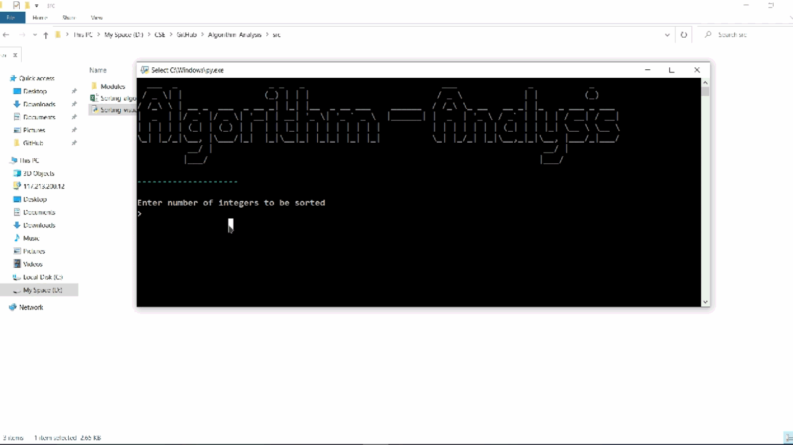
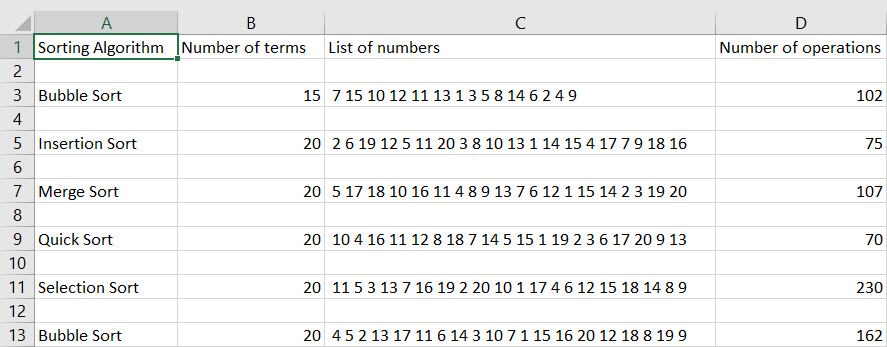

# Algorithm-Analysis

    
     Analysis of various sorting algorithms. 

---
## Motivation

This project helps in understanding the time complexity, that is to find out and analyse the time taken for each of the sorting algorithms to complete sorting a fixed or random dataset. Analysis of these algorithms help us in determining the quickest and most effective method to sort data under various circumstances and scenarios.

## Installation

For the latest stable version, head to [Releases](https://github.com/sabareeshreddy/Algorithm-Analysis/releases).

Download and extract the source code.

As an alternative, you could also clone the repository using,

<pre>
git clone https://github.com/sabareeshreddy/Algorithm-Analysis.git
</pre>

## Usage

Once you have all the files on your local system, you can launch it by double-tapping the `Sorting_visualizer.py` file present in the **`src`** folder. You can do this only if you have the _python launcher_ installed.

Else, `cd/` to the src folder on your terminal and type `python Sorting_visualizer.py`.

Enter the number of terms to be sorted and select your sorting algorithm.

**Note**: Once the visualization is completed, you can find all the information about it present within the `Sorting_algorithm_data.csv` file created in the src folder.

## Demo

    

    
     Data collected

## License
Algorithm_Analysis is under The MIT License. Read the [LICENSE](https://github.com/sabareeshreddy/Algorithm_Analysis/blob/main/LICENSE) file for more information.

